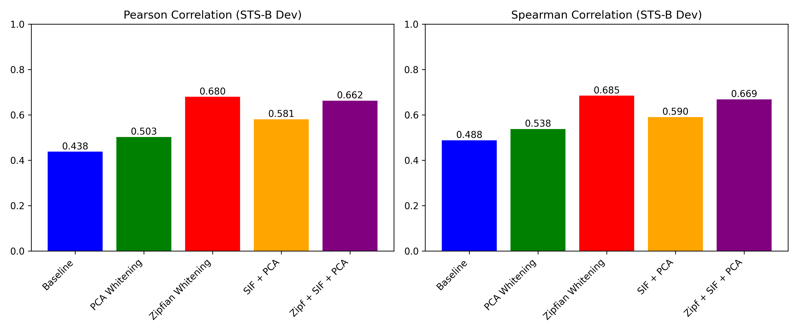

# STS-B Sentence Embedding Evaluation with PCA / Zipfian Whitening / SIF

このリポジトリは、STS-B(STS-Benchmark)データセットを用いて以下の手法による文埋め込み間類似度評価を行うスクリプトを提供します。

- **Baseline:** 生のGloVe埋め込み平均
- **PCA Whitening:** 生埋め込みをPCAホワイトニング
- **Zipfian Whitening:** 単語頻度を考慮した加重PCA（Zipfian whitening）による変換
- **SIF + PCA:** SIF(Smooth Inverse Frequency)重み付けによる埋め込み平均後にPCAホワイトニング
- **Zipfian + SIF + PCA:** SIF重み付けとZipfian whiteningを組み合わせた変換

## 特徴

- 必要なGloVe埋め込み(`glove.6B.300d.txt`)が存在しない場合は自動的にダウンロード・解凍します。
- STS-Bデータセットは`datasets`ライブラリを通じて自動的に取得できます。
- Pearson相関係数、Spearman相関係数による評価結果を表示し、棒グラフで可視化します。
- 再現性確保のためのシード設定や、結果を画像ファイルとして保存するオプションを提供します。

## 環境構築

以下のライブラリが必要です。

- Python 3.7+
- `pip install -r requirements.txt` （以下をrequirements.txtに記載することを推奨）

## セットアップ

```bash
git clone <THIS_REPOSITORY_URL>
cd <REPO_DIRECTORY>

# 必要なライブラリをインストール
pip install -r requirements.txt
```

## 実行方法

```bash
python main.py [--emb_path ./embeddings/glove.6B.300d.txt] [--emb_dim 300] [--save_plot result.png] [--seed 42]
```

## 結果



## 参考文献
- Datasets: Hugging Face Datasets
- GloVe: Stanford GloVe
- [A Simple but Tough-to-Beat Baseline for Sentence Embeddings](https://openreview.net/forum?id=SyK00v5xx)
- [Zipfian Whitening](https://arxiv.org/abs/2411.00680)
